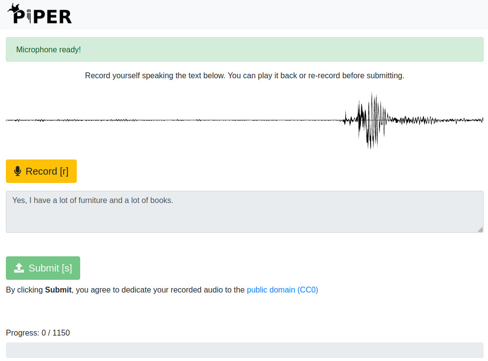

# Voice Dataset Manager - Custom TTS Voice Training

A comprehensive web application for **creating custom voice models** for AI voice synthesis. Features recording, phoneme alignment, and Piper TTS model training.

> **📋 Installation Options:** Choose your preferred setup. Standard installation provides full training capabilities. See [MFA_ESSENTIAL_README.md](MFA_ESSENTIAL_README.md) for optional MFA enhancements.

> **🗑️ Uninstall:** Complete removal script available: `./uninstall.sh`

> **🐳 Docker Users (Recommended):** See [DOCKER_README.md](DOCKER_README.md) - Includes GPU + MFA support with zero setup!
> - **NVIDIA GPU**: `docker-compose --profile gpu up -d`
> - **Apple Silicon (M1/M2/M3)**: `docker-compose --profile arm64 up -d` ⭐ NEW
> - **CPU-only**: `docker-compose --profile cpu up -d`

> **📌 Windows Users:** See [WINDOWS_README.md](WINDOWS_README.md) for Windows-specific installation instructions

> **📌 All Users:** For quick setup, see [SETUP_GUIDE.md](SETUP_GUIDE.md)

> **📁 File Structure:** See [FILE_STRUCTURE.md](FILE_STRUCTURE.md) for complete repository documentation

## Features

- **Voice Profile Management**: Create and manage different voice profiles for different speakers
- **Prompt Lists**: Organize and manage text prompts for voice recording sessions
- **Audio Recording**: Built-in web-based audio recorder with real-time visualization
- **Dataset Export**: Export recordings in Piper-compatible format for AI voice synthesis
- **Progress Tracking**: Monitor recording progress and statistics
- **Modern Web Interface**: Clean, responsive design with Bootstrap 5

## Quick Start

### Self-Contained Setup (Recommended)

This application is completely self-contained within the `coaxial_recorder` folder. All scripts use relative paths and work from any location.

1. **Setup (First Time Only)**:
   ```bash
   ./setup_venv.sh
   ```
   This creates a virtual environment and installs all dependencies.

2. **Launch Application**:
   ```bash
   ./launch.sh
   ```
   This activates the virtual environment and starts the web server.

3. **Open your browser** and navigate to `http://localhost:8000/record`

4. **Stop Application**:
   ```bash
   ./kill_app.sh
   ```
   This stops the application and frees up all ports.

### Manual Setup (Alternative)

#### Prerequisites

- Python 3.7+
- Modern web browser with Web Audio API support
- Microphone access for recording

#### Installation

1. **Clone or download the project**:
   ```bash
   git clone <repository-url>
   cd voice-dataset-manager
   ```

2. **Create and activate virtual environment**:
   ```bash
   python -m venv venv
   source venv/bin/activate  # On Windows: venv\Scripts\activate
   ```

3. **Install dependencies**:
   ```bash
   pip install -r requirements.txt
   ```

4. **Run the application**:
   ```bash
   python app.py
   ```

5. **Open your browser** and navigate to `http://localhost:8000`

## Usage

### Creating Voice Profiles

1. Navigate to the "Profiles" section
2. Click "Create New Profile"
3. Enter a name and description for the voice profile
4. Click "Create Profile"

### Setting Up Prompt Lists

1. Go to the "Profiles" section
2. Click "Manage Prompt Lists"
3. Create a new prompt list or upload an existing one
4. Add text prompts for your recording session

### Recording Audio

1. Select a voice profile from the dropdown
2. Choose a prompt list
3. Click "Record" to start recording the current prompt
4. Speak the displayed text clearly
5. Click "Stop" when finished
6. Preview your recording and click "Save" to keep it
7. Move to the next prompt automatically

### Exporting Datasets

1. Navigate to the "Export" section
2. Select the voice profile to export
3. Choose export format (Piper-compatible)
4. Click "Export Dataset"
5. Download the generated dataset files

## Project Structure

```
voice-dataset-manager/
├── app.py                    # Main FastAPI application
├── requirements.txt          # Python dependencies
├── utils/
│   ├── audio.py             # Audio processing utilities
│   └── export.py            # Dataset export functionality
├── templates/
│   ├── index.html           # Main dashboard
│   ├── record.html          # Recording interface
│   └── profiles.html        # Profile management
├── static/
│   ├── css/
│   │   └── style.css        # Custom styles
│   └── js/
│       ├── app.js           # Main application logic
│       └── recording.js     # Recording functionality
├── voices/                   # Voice profile data
│   └── example/             # Example voice profile
├── recordings/              # Audio recordings storage
└── templates/               # Dataset templates

```

## API Endpoints

### Voice Profiles
- `GET /api/voice-profiles` - List all voice profiles
- `POST /api/voice-profiles` - Create new voice profile
- `GET /api/voice-profiles/{id}` - Get voice profile details
- `PUT /api/voice-profiles/{id}` - Update voice profile
- `DELETE /api/voice-profiles/{id}` - Delete voice profile

### Prompt Lists
- `GET /api/prompt-lists` - List all prompt lists
- `POST /api/prompt-lists` - Create new prompt list
- `GET /api/prompt-lists/{id}` - Get prompt list details
- `PUT /api/prompt-lists/{id}` - Update prompt list
- `DELETE /api/prompt-lists/{id}` - Delete prompt list

### Recordings
- `GET /api/recordings` - List all recordings
- `POST /api/recordings` - Upload new recording
- `GET /api/recordings/{id}` - Get recording details
- `DELETE /api/recordings/{id}` - Delete recording

### Export
- `GET /api/export/{voice_profile_id}` - Export voice profile dataset

## Audio Processing

The application includes several audio processing features:

- **Format Conversion**: Automatically converts recordings to WAV format
- **Volume Normalization**: Normalizes audio volume levels
- **Silence Trimming**: Removes leading and trailing silence
- **Audio Analysis**: Provides duration and volume analysis

## Dataset Export Formats

### Piper-Compatible Format
Exports datasets in the format expected by Piper voice synthesis:
- Audio files in WAV format (16kHz, 16-bit, mono)
- Metadata file with transcription data
- Speaker information and voice profile details

## Browser Compatibility

- **Chrome/Chromium**: Full support with all features
- **Firefox**: Full support with all features
- **Safari**: Full support with all features
- **Edge**: Full support with all features

Requires browser support for:
- Web Audio API
- MediaRecorder API
- getUserMedia API

## Configuration

### Audio Settings
Default audio settings are optimized for voice recording:
- Sample rate: 44.1 kHz
- Channels: Mono (1 channel)
- Format: WAV
- Bit depth: 16-bit

### Storage
- Recordings are stored in the `recordings/` directory
- Voice profiles are stored in the `voices/` directory
- Both can be configured in the application settings

## Management Scripts

The application includes several management scripts for easy operation:

- **setup_venv.sh**: Creates virtual environment and installs dependencies
- **activate_venv.sh**: Activates the virtual environment manually
- **launch.sh**: Activates environment and starts the application
- **kill_app.sh**: Stops the application and cleans up ports

All scripts use relative paths and can be run from any location within the project folder.

## Troubleshooting

### Recording Issues
- Ensure microphone permissions are granted
- Check that no other application is using the microphone
- Try refreshing the page if recording fails

### Browser Issues
- Clear browser cache and cookies
- Disable browser extensions that might interfere
- Check browser console for error messages

### Audio Quality
- Use a good quality microphone
- Record in a quiet environment
- Speak clearly and at a consistent volume
- Position microphone 6-12 inches from mouth

## Contributing

1. Fork the repository
2. Create a feature branch
3. Make your changes
4. Add tests if applicable
5. Submit a pull request

## License

This project is open source and available under the MIT License.

## Support

For issues and questions:
1. Check the troubleshooting section
2. Search existing issues
3. Create a new issue with detailed information

## Roadmap

- [ ] Multi-language support
- [ ] Advanced audio effects
- [ ] Batch processing capabilities
- [ ] Cloud storage integration
- [ ] Mobile app companion
- [ ] Advanced voice analysis tools
=======
# Piper Recording Studio

Local tool for recording yourself to train a [Piper text to speech](https://github.com/rhasspy/piper) voice.



[](https://nabucasa.com)


## Tutorial

See a [video tutorial](https://www.youtube.com/watch?v=Z1pptxLT_3I) by [Thorsten Müller](https://www.thorsten-voice.de/)


## Docker

``` sh
docker run -it -p 8000:8000 -v '/path/to/output:/app/output' rhasspy/piper-recording-studio
```

Visit http://localhost:8000 to select a language and start recording.

Add `--help` to see more options.


### Building

``` sh
docker build . -t rhasspy/piper-recording-studio
```


## Installing without Docker

``` sh
git clone https://github.com/rhasspy/piper-recording-studio.git
cd piper-recording-studio/

python3 -m venv .venv
source .venv/bin/activate
python3 -m pip install --upgrade pip
python3 -m pip install -r requirements.txt
```


## Running without Docker

``` sh
python3 -m piper_recording_studio
```

Visit http://localhost:8000 to select a language and start recording.

Prompts are in the `prompts/` directory with the following format:

* Language directories are named `<language name>_<language code>`
* Each `.txt` in a language directory contains lines with:
    * `<id>\t<text>` or
    * `text` (id is automatically assigned based on line number)

Output audio is written to `output/`

See `--debug` for more options.


## Exporting

Install ffmpeg:

``` sh
sudo apt-get install ffmpeg
```

Install exporting dependencies:

``` sh
python3 -m pip install -r requirements_export.txt
```

Export recordings for a language to a Piper-compatible dataset (LJSpeech format):

``` sh
python3 -m export_dataset output/<language>/ /path/to/dataset
```

Requires a non-Docker install. If you used Docker to record your dataset, you may need to adjust the permissions of the output directory:

``` sh
sudo chown -R "$(id -u):$(id -u)" output/
```

See `--help` for more options. You may need to adjust the silence detection parameters to correctly remove button clicks and keypresses.


## Multi-User Mode

``` sh
python3 -m piper_recording_studio --multi-user
```

Now a "login code" will be required to record. A directory `output/user_<code>/<language>` must exist for each user and language.
>>>>>>> master
